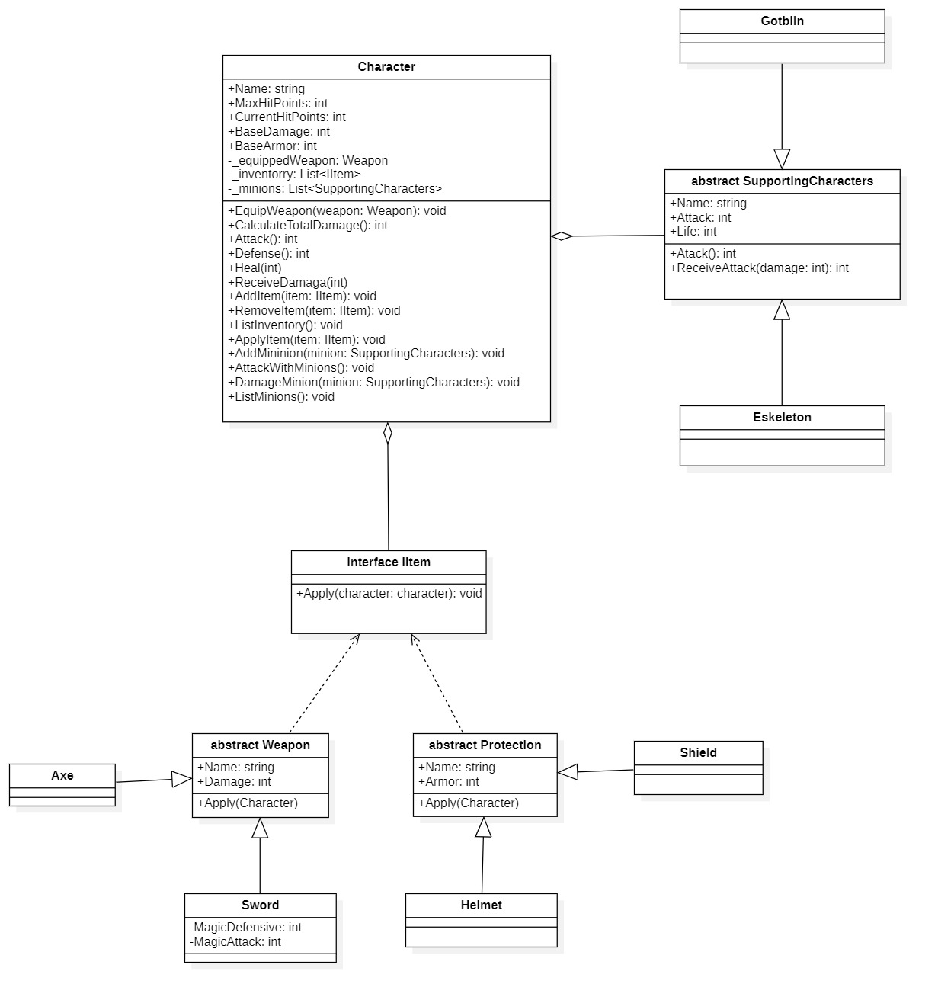

# **Profundizando en las técnicas de OOP**

Ejercicio propuesto en clase.

Diseñar un sistema que implemente asociado al personaje la posibilidad de tener objetos que generen mascotas (minions).

## **_Explicación_**:

La clase SupportingCharacters es una clase abstracta que define el comportamiento general y las propiedades de todos los personajes de apoyo.
Skeleton y Goblin son subclases concretas que heredan todas las propiedades y comportamientos de SupportingCharacters, pero cada una puede tener valores predeterminados a través del constructor.

La ventaja de la herencia es que puedes gestionar distintos tipos de minions bajo una misma interfaz. Esto significa que el Character no necesita saber si tiene un Goblin o un Skeleton como 'minion', simplemente sabe que es un SupportingCharacters y puede llamarlo para atacar o recibir daño sin preocuparse por la implementación.
## **_Resumen de la relacion_**:

Character tiene una relación de agregación con SupportingCharacters, lo que implica que gestiona una lista de minions, pero estos pueden existir de manera independiente. Skeleton y Goblin son subclases de SupportingCharacters y heredan sus métodos y atributos, aunque cada una puede tener sus propios valores predeterminados.

Esto nos permite tener un diseño flexible que facilita la incorporación de otros tipos de personajes de apoyo en el futuro, simplemente creando nuevas subclases